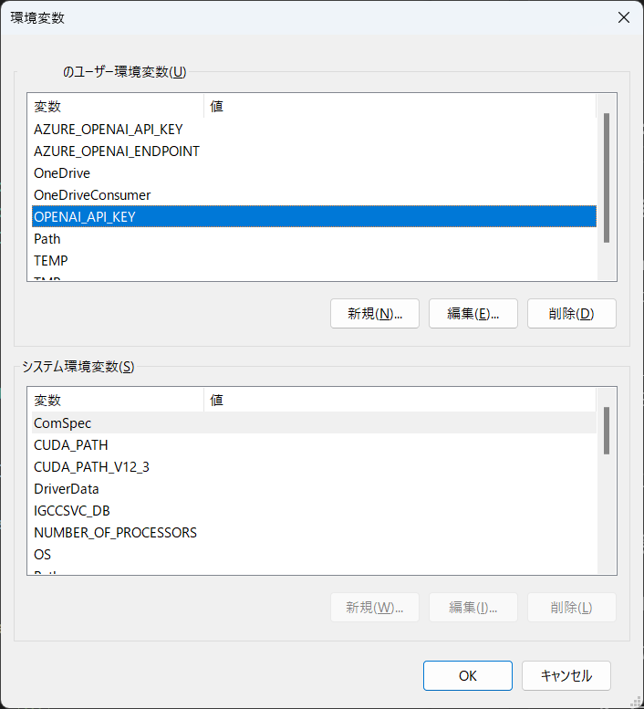
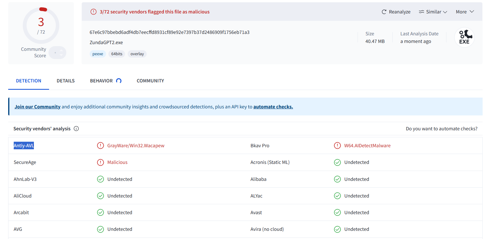

#  ZundaGPT2

Copyright (c) 2024-2025 led-mirage

[English](Readme.en.md)

## 概要

AIとチャットするアプリなのだ。質問と回答を音声で読み上げてくれるのが特徴なのだ。

使用できるAIは以下の通りなのだ。

- OpenAI GPT (Azure OpenAI Serviceも利用可能)
- Google Gemini
- Anthropic Claude

## 最新情報

### バージョン 1.8.0

コードブロックにコピーボタンをつけて、簡単にクリップボードにコピーできるようにしたのだ✨

### バージョン 1.7.0

設定画面からチャット設定ファイルを開けるようにしたのだ✨

### バージョン 1.6.0

言語サポート機能（英語）を追加したのだ✨

## スクリーンショット


v1.4.0 - v1.5.0 紹介動画

https://github.com/user-attachments/assets/3be5b9bd-e9ba-49a9-bf3f-8de74b3c3909

過去のバージョンの紹介動画は[こちら](Readme_note.md)を見て欲しいのだ。

## 動作確認環境

- Windows 11 Pro 23H2、24H2
- Python 3.12.0
- VOICEVOX 0.22.3
- A.I.VOICE Editor 1.4.10.0
- COEIROINK v.2.3.4

## 言語サポート

バージョン1.6.0から表示言語を日本語と英語から選べるようになったのだ。

使用する言語を変更するには`appConfig.json`ファイルの`language`設定を変更すればいいのだ。

```json
"language": "en"
```

設定できる値は ja（日本語）と en（英語）なのだ。

また、英語版のキャラクター設定ファイル settings.en.jsonも用意したので、それも使ってみるといいのだ。

## 必要なもの

このアプリ自体は無料だけど、このアプリを動作させるには以下のいずれかのAPIキーが必要になるのだ。

ここでは軽く触れておくだけにするけど、詳しいことは[こっち](Readme_detail.md)を見てほしいのだ。

### ✅ OpenAIアカウントとAPIキー

このアプリ自体は無料だけど、[OpenAI](https://platform.openai.com/)のアカウントとAPIの利用登録（課金およびAPIキーの作成）が必要なのだ。

### ✅ Google Gemini APIのAPIキー

バージョン0.11.0からGoogle Gemini APIにも対応したので、OpenAIの代わりにGoogle Gemini APIを使用することもできるのだ。

現時点でGoogle Gemini APIには無料プランが設定されているので、OpenAIのAPIよりも気軽に利用することができるのだ。Google Gemini APIを使用したい場合は、[専用の資料](Readme_gemini.md)を用意したので、それを参照して欲しいのだ。

### ✅ Anthropic APIのAPIキー

バージョン1.4.0からAnthropic API（Claudeシリーズ）にも対応したのだ。

APIを利用するにはAnthropic ConsoleのアカウントとAPIの利用登録（課金およびAPIキーの作成）が必要なのだ。

2024年12月29日時点の最新のモデルはClaude 3.5 Sonnetなのだ。

### ✅ テキスト読み上げソフトウェア

このアプリは以下のテキスト読み上げソフトウェアに対応しているのだ。どれか一つでいいからPCにインストールしておく必要があるのだ。

- [VOICEVOX](https://voicevox.hiroshiba.jp/)（無料）
- [COEIROINK](https://coeiroink.com/)（無料）
- [A.I.VOICE](https://aivoice.jp/)（有料）
- Google Text-to-Speech（無料）… FFmpegが必要
- SAPI5（無料）… インストール不要

用意ができたら、次の実行方法にゴーなのだ。

## 実行方法

### 🛩️ 準備：OSの環境変数を追加

使用するAIのAPIキーをOSの環境変数に登録しておく必要があるのだ。

| AI | 変数名 | 値 |
|------|------|------|
| OpenAI | OPENAI_API_KEY  | OpenAIで取得したAPIキー |
| Google Gemini | GEMINI_API_KEY  | Googleで取得したAPIキー |
| Anthropic Claude | ANTHROPIC_API_KEY  | Anthropicで取得したAPIキー |

Windowsの場合は、Windowsの検索窓で「環境変数を編集」で検索すると設定画面が立ち上がるので、そこでユーザー環境変数を追加すればいいのだ。



### 🛩️ 実行方法①：実行ファイル（EXEファイル）を使う方法

#### 1. プロジェクト用のフォルダの作成

任意の場所にプロジェクト用のフォルダを作成するのだ。

#### 2. アプリのダウンロード

以下のリンクから ZundaGPT2.ZIP をダウンロードして、作成したフォルダに展開するのだ。

https://github.com/led-mirage/ZundaGPT2/releases/tag/v1.8.0

#### 3. 実行

ZundaGPT2.exeをダブルクリックすればアプリが起動するのだ。

※起動時にスプラッシュ画面を表示したくない人は、`ZundaGPT2.ns.exe`を替わりに使ってほしいのだ。

#### 4. 注意事項

この実行ファイル（EXEファイル）は PyInstaller というライブラリを使って作成しているんだけど、割と頻繁にウィルス対策ソフトにマルウェアとかウィルスとかに誤認されるのだ。ネットとかを見るとこの問題が結構書かれているので、よくある事象のようだけど、残念なことに根本的な解決策は見つかっていないのだ。

もちろん、このアプリに悪意のあるプログラムは入っていないのだけど、気になる人は下の「Pythonで実行する方法」で実行してほしいのだ。

### 🛩️ 実行方法②：Pythonで実行する方法

#### 1. Pythonのインストール

あらかじめ Python 3.12.0 が動く環境を作っておくのだ。他のバージョンでも動くかもしれないけど、確認はしていないのだよ。

ボクは pyenv-win + venv で仮想環境を作ってそこで開発しているから、そういった方法でも問題ないのだ。

#### 2. プロジェクト用のフォルダの作成

任意の場所にプロジェクト用のフォルダを作成するのだ。

#### 3. ターミナルの起動

ターミナルかコマンドプロンプトを起動して、作成したプロジェクトフォルダに移動するのだ。

#### 4. ソースファイルのダウンロード

ZIPファイルをダウンロードして作成したフォルダに展開するのだ。  
または、Gitが使える方は以下のコマンドを実行してクローンしてもOKなのだ。

```bash
git clone https://github.com/led-mirage/ZundaGPT2.git
```

#### 5. ライブラリのインストール

コマンドプロンプトから以下のコマンドを実行して、必要なライブラリをインストールするのだ。

```bash
pip install -r requirements.txt
```

#### 6. 実行

コマンドプロンプトから以下のコマンドを実行するとアプリが起動するのだ。

```bash
python app\main.py
```

#### 7. 起動用のバッチファイル（オプション）

以下のような起動用のバッチファイルを用意しておくと便利なのだ。

```bash
start pythonw app\main.py
```

Pythonの仮想環境を使用している場合は、以下の例のようにすればOKなのだ。

```bash
call venv\scripts\activate
start pythonw app\main.py
```

## キャラクターの設定

画面右上の⚙️ボタンを押すことで、使用するキャラクターを選択することができるのだ。

いくつかのデフォルトの設定がすでにあるけれど、設定ファイルをコピーして自分で編集することで自分好みのキャラクターを作ることができるのだ。

キャラクターの設定ファイル（settings_xxx.json）はsettingsフォルダの中に格納されているから、それをコピーして編集すればOKなのだ。

詳しい設定方法は(こちら)[Readme_detail.md]をみて欲しいのだ。

## 注意事項

### ⚡ OpenAIの利用料金について

このアプリは無料だけど、OpenAI APIを使うには別途料金が発生するのだ（お試し用の無料枠もあるけど）。なので、使い過ぎには注意するのだ。定期的にOpenAIのサイトで現在の利用状況を確認するなどして自己管理して欲しいのだ。

そもそも自動チャージ設定を有効にしなければチャージされた分しか課金されないはずなので、そこまで心配する必要はないけれど、OpenAIのサイトでは月毎の利用上限なども設定できるのでそれらを活用して思わぬ出費を防ぐといいのだ。

### ⚡ Google Gemini APIの利用料金について

[この資料](Readme_gemini.md)にも書いたけど、現時点でGoogle Gemini APIには無料枠があるのだ。だから、基本的には無料枠を使ってアプリを利用すればいいと思うけど、もっとハードに使いたい場合は有料プランを考えてみるのもいいのだ。ただ、有料プランにした場合は、先に書いたOpenAIと同じように使い過ぎには注意して欲しいのだ。

### ⚡ Anthropic APIの利用料金について

Anthropic APIを利用するのにも別途料金（従量制）が発生するのだ。2024年12月29日時点で確認したところ、無料枠というものはなさそうなのだ。クレジットカードで好きな金額を課金するとAPIを利用できるようになるのだ。ただ、他のAPIと同じように使い過ぎには注意して欲しいのだ。

### ⚡ APIキーの重要性について

各AIのAPIキーはあなただけのものなので、人に教えたらダメなのだ。流出すると悪い人に勝手に使われてしまう可能性があるのだ。もし流出してしまったら、各AIの管理サイトで現在使っているAPIキーを削除して、別のAPIキーを作ればいいのだ。

ただOpenAIでは、APIキーをひとつしか持っていない場合、新しいAPIキーを作ってからじゃないと古いAPIキーを削除できないようなのだ。これはOpenAIの仕様のようなんだけど、ボク的にはちょっといただけない仕様だと思っているのだ。将来的に改善することを願っているけれど、最悪支払い情報（クレジットカード情報）を削除してしまえばいいような気もするのだ。

なにわともあれ、APIキーと利用料金には注意を払って欲しいのだ。

### ⚡ ウィルス対策ソフトの誤認問題

上でも書いているけれど、配布している実行ファイル（EXEファイル）が、マルウェアやウィルスに誤認されてしまうことがあるのだ。問題はPythonのプログラムを一つの実行ファイル（EXEファイル）にまとめることにあるようなのだが、回避方法がないためどうしようもないのだ。

これが嫌な人は（ボクも嫌だけど）、Python本体をインストールしてPythonから普通に実行して欲しいのだ。実行ファイルのほうが手軽だし、そのほうがPythonに詳しくない人にとっては簡単なんだけど、誤認問題がついて回ることは覚えておいて欲しいのだ。

VirusTotalでの[チェック結果](https://www.virustotal.com/gui/file/67e6c97bbebd6adf4db7eecffd8931cf89e92e7397b37d2486909f1756eb71a3)は以下の通りなのだ。  
（72個中3個のアンチウィルスエンジンで検出 :2025/02/02 v1.8.0）。



### ⚡ 免責事項

いまのところ特に問題点は見つかっていないけど、バグなんてものは潜在的に必ずあるし、０になるなんてことはあり得ないのだ。また、もしバグがあってそのせいで貴方に損害を与えたとしても、著作権者はいかなる責任も負いかねるのでその点を理解して使って欲しいのだ。

## 使用しているライブラリ

### 🔖 pywebview 5.3.2

ホームページ： https://github.com/r0x0r/pywebview  
ライセンス：BSD-3-Clause license

### 🔖 openai 1.57.0

ホームページ： https://github.com/openai/openai-python  
ライセンス：Apache License 2.0

### 🔖 google-generativeai 0.8.3

ホームページ： https://github.com/google-gemini/generative-ai-python  
ライセンス：Apache License 2.0

### 🔖 anthropic 0.42.0

ホームページ： https://github.com/anthropics/anthropic-sdk-python  
ライセンス：MIT license

### 🔖 gTTS 2.5.1

ホームページ： https://github.com/pndurette/gTTS  
ライセンス：MIT License

### 🔖 requests 2.32.3

ホームページ： https://requests.readthedocs.io/en/latest/  
ライセンス：Apache License 2.0

### 🔖 PyAudio 0.2.14

ホームページ： https://people.csail.mit.edu/hubert/pyaudio/  
ライセンス：MIT License

### 🔖 pythonnet 3.0.3

ホームページ：https://github.com/pythonnet/pythonnet  
ライセンス：MIT License

### 🔖 langdetect 1.0.9

ホームページ：https://github.com/Mimino666/langdetect  
ライセンス：Apache License 2.0

### 🔖 pydub 0.25.1

ホームページ：https://github.com/jiaaro/pydub  
ライセンス：MIT License

### 🔖 pywin32 306

ホームページ：https://github.com/mhammond/pywin32  
ライセンス：Python Software Foundation License (PSF)

### 🔖 MathJax 3.2.2

ホームページ： https://github.com/mathjax/MathJax  
ライセンス：Apache License 2.0

### 🔖 Highlight.js 11.9.0

ホームページ：https://github.com/highlightjs/highlight.js  
ライセンス：BSD-3-Clause license

### 🔖 Marked 12.0.0

ホームページ：https://github.com/markedjs/marked  
ライセンス：MIT license

### 🔖 mark.js 8.11.1

ホームページ：https://github.com/julkue/mark.js  
ライセンス：MIT license

### 🔖 Font Awesome Free 6.7.2

ホームページ：https://fontawesome.com/
ライセンス：Icons: CC BY 4.0, Fonts: SIL OFL 1.1, Code: MIT License

## 資料

- [VOICEVOXキャラクターリスト](doc/voicevox_speaker_list.md)
- [COEIROINKキャラクターリスト](doc/coeiroink_speaker_list.md)
- [炬燵で快適！VOICEVOXとZundaGPT2を別のPCで連携する方法](炬燵で快適！VOICEVOXとZundaGPT2を別のPCで連携する方法.md)
- [炬燵で快適！COEIROINKとZundaGPT2を別のPCで連携する方法](炬燵で快適！COEIROINKとZundaGPT2を別のPCで連携する方法.md)

## ライセンス

© 2024-2025 led-mirage

本アプリケーションは [MITライセンス](https://opensource.org/licenses/MIT) の下で公開されているのだ。詳細については、プロジェクトに含まれる LICENSE ファイルを参照して欲しいのだ。

## バージョン履歴

### 1.8.0 (2025/02/02)

- コードブロックにクリップボードにコピーするボタンを追加

### 1.7.0 (2025/01/26)

- 設定画面にチャット設定ファイルをオープンする機能を追加
- Fix: 文字列のエスケープ処理が抜けている個所を修正

### 1.6.2 (2025/01/25)

- Fix: 環境変数がセットされていないときのエラー処理を変更
- ZundaGPT2Liteに合わせるために、バージョン1.6.1は欠番

### 1.6.0 (2025/01/19)

- 言語サポート機能の追加（英語）
- Fix: index.htmlで使っているscriptタグにSRIハッシュを追加

### 1.5.0 (2025/01/04)

- チャットアイコンを表示する機能を追加

### 1.4.3 (2025/01/02)

- リプレイ機能（実験的機能）の実装… Ctrl + R でリプレイ開始
- Anthropic APIでエラーが発生したときのメッセージを分かりやすくした

### 1.4.2 (2025/01/01)

- コードブロック中にURLがあった場合に、不要な変換がおこなわれてしまう不具合を修正

### 1.4.1 (2024/12/30)

- appConfig.jsonの`voicevox_server`と`coeiroink_server`がプログラムに反映されないバグを修正

### 1.4.0 (2024/12/29)

- Anthropic社のAI、Claudeシリーズに対応
- チャット内容の表示を改善

### 1.3.0 (2024/12/07)

- 起動時に表示されるスプラッシュ画面を追加
- pywebviewのバージョンを5.3.2に更新
- openaiのバージョンを1.57.0に更新
- google-generativeaiのバージョンを0.8.3に更新

### 1.2.1 (2024/7/06)

- 回答表示処理中にブラウザでエラー（OUT OF MEMORYなど）が発生する場合がある問題に対処  
  parsedSentenceメソッド中のMathJax.typesetPromise()をコメントアウト

### 1.2.0 (2024/6/23)

- アプリケーションアイコンの追加
- 印刷する場合、codeブロックの中のテキストを右端で折り返すように修正

### 1.1.0 (2024/6/22)

- 印刷機能の追加
- 画面上部のボタンにツールチップを追加
- PyInstallerのバージョンを6.8.0に更新

### 1.0.1 (2024/6/8)

- openaiのバージョンを1.33.0に更新
- google-generativeaiのバージョンを0.6.0に更新
- requestsのバージョンを2.32.3に更新
- 再生環境による文末の音声途切れ問題を軽減するため、再生終了後に0.2秒間の待機時間を追加

### 1.0.0 (2024/6/2)

- Google Text-to-Speechに対応
- SAPI5に対応
- requestsのバージョンを2.32.2に更新
- バージョンを1.x.xに改定

### 0.11.0 (2024/5/19)

- Google Gemini APIに対応

### 0.10.0 (2024/4/29)

- Tex形式の行列式が正しく表示されない問題を解消

### 0.9.0 (2024/4/21)

- Readmeの使用しているライブラリ欄に、pywebviewの記載が洩れていたため追記
- openaiのバージョンを1.12.0から1.23.2に更新
- ChatAPIのタイムアウト値を設定ファイル（app_config.json）に持つように変更
- AIの回答中にあるURLが正しくリンク表示にならない問題に対処

### 0.8.0 (2024/4/6)

- メッセージ送信中止機能を追加
- Ctrl + F でテキストを検索する機能を追加（F3 or Shift + F3で候補移動）
- Welcomeメッセージの追加
- 設定ファイルのフォーマット変更（Welcome関連項目追加）
- Copyrightを動的に設定するように修正
- 英文が右端で折り返さない問題を修正

### 0.7.0 (2024/3/30)

- 再回答ボタンを追加
- チャットログが１つしかない場合に、そのログを削除できないバグを修正

### 0.6.0 (2024/3/23)

- メッセージの削除ボタンを追加
- PyInstallerの更新（6.4.0を使用）

### 0.5.1 (2024/3/16)

- 0.5.0で発生した数式が正しくレンダリングされないバグ（デグレード）を修正

### 0.5.0 (2024/3/9)

- マークダウン形式のテキストをHTMLに変換するように変更
- チャットリクエストがタイムアウトした際、リトライするかユーザーに選択してもらうように修正

### 0.4.0 (2024/3/3)

- 設定ファイルをappConfig.jsonとsettings.jsonに分離
- settings.jsonを配置するフォルダをsettingsフォルダに変更
- 設定の切り替えを行うUIを追加
- 画面左上に現在の設定のdisplay_nameを表示するように変更
- ウィンドウがフォーカスを失った後に再度戻ってくると、IMEの変換がうまくいかなくなる問題に対処
- チャットリクエスト時のタイムアウト処理を変更
- スピーカーのON/OFFを切り替えれるように変更
- ウィンドウサイズの初期値を設定ファイルで指定できるように変更
- その他、バグ修正、微調整など

### 0.3.0 (2024/2/23)

- 表示しているチャットのログファイル名をタイトルバーに表示するようにした
- 数式を左寄せ表示するように修正
- 発声時のエラー処理を修正

### 0.2.0 (2024/2/18)

- ログに記録した以前のチャットに移動する機能を追加（prev、next）
- 新しいチャットを開始している機能を追加（new）
- チャットを削除する機能を追加
- TeX形式の数式を表示する機能を追加
- ログファイルの形式を変更
- チャットリクエスト時のタイムアウト処理の追加
- その他バグ修正など

### 0.1.1 (2024/2/13)
 
- ソース添付のsettings.jsonを変更。プログラムに変更なし。

### 0.1.0 (2024/2/12)
 
- ファーストリリース
