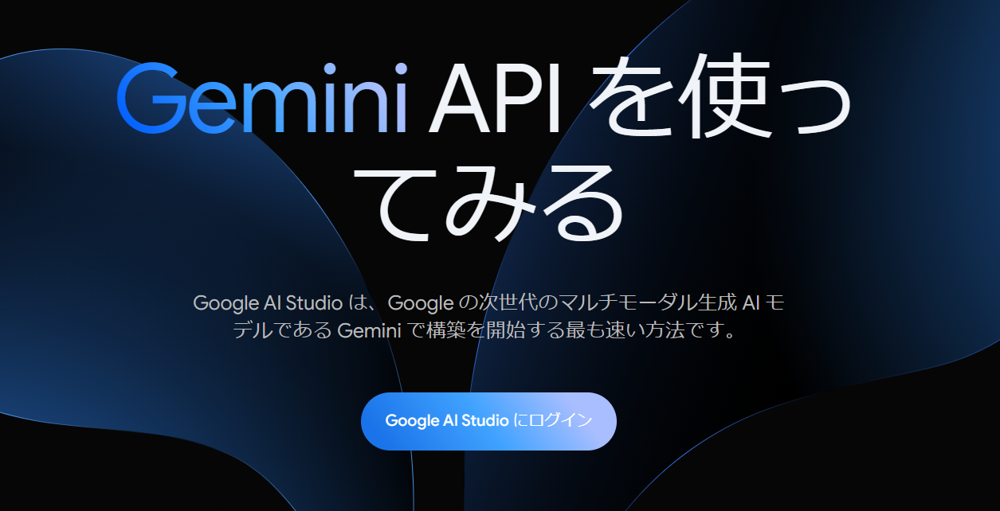
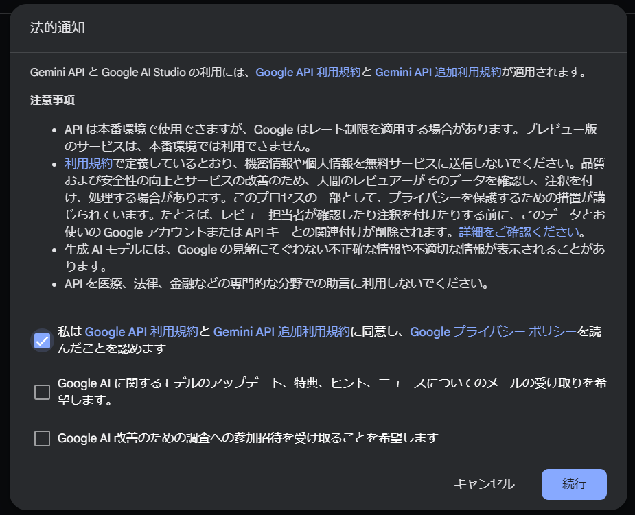
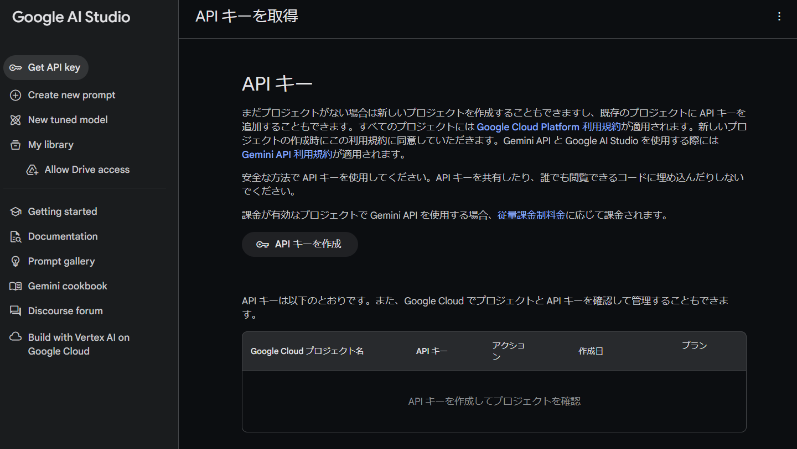
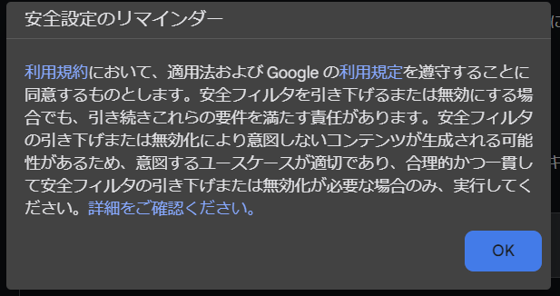
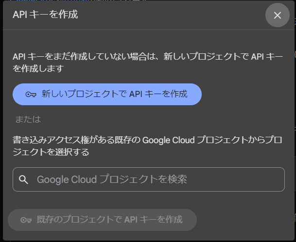
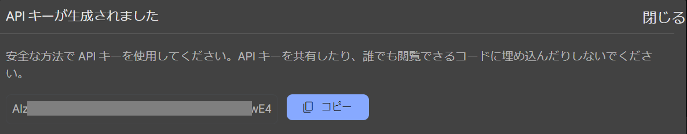
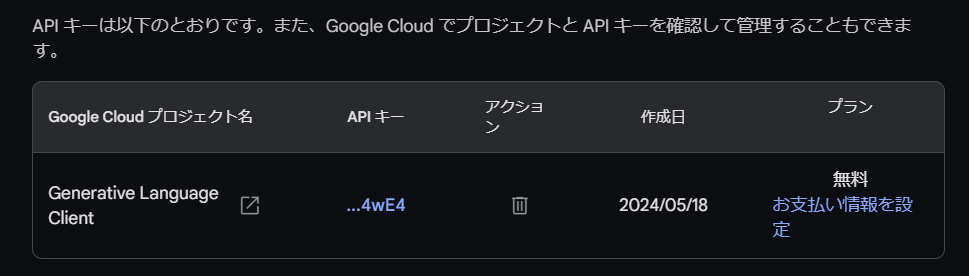
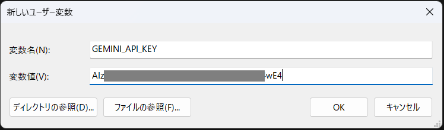

# Google Geminiを利用する方法

Copyright (c) 2024 led-mirage

## 0. はじめに

このアプリ（ZundaGPT2）はバージョン0.11.0から、OpenAI APIのほか、Google Gemini APIを利用できるようになりました。2024年5月19日現在、Google Gemini APIには無料枠があるので、それがOpenAI APIと比べて大きな魅力になっています。さらに最近リリースされたGemini 1.5はOpen AIのGPT4と比べても遜色のない性能となっており、これも大きな魅力です。

そんなわけで、Geminiは大変魅力的なGoogleのAIですが、APIを利用するにはGoogle AI StudioでAPIキーを取得する必要があります。ここでは、そのAPIキーの取得方法とZundaGPT2での設定方法について解説します。

## 1. 予備知識

2024年5月19日現在、Google Gemini APIは無料で利用できます。無料版は有料版に比べてレート制限が厳しくなります。以下のサイトで料金と制限について確認できます。

https://ai.google.dev/pricing?hl=ja

Google Gemini APIで使用できるモデルは次の３種類です。

- Gemini 1.5 Flush  
卓越したスピードと効率を備えた、Google の最速のマルチモーダル モデルで、迅速かつ高頻度のタスクを実現します。現在はプレビュー版でご利用いただけます。（Googleのサイトから引用）
- Gemini 1.5 Pro  
深い推論と微妙な違いの理解が求められる複雑なタスク向けの高性能なマルチモーダル モデル。現在はプレビュー版でご利用いただけます。（Googleのサイトから引用）
- Gemini 1.0 Pro  
テキストと画像の推論のみを提供する Google の第 1 世代モデル。本番環境用に一般提供されています。（Googleのサイトから引用）

無料版と有料版とのレート制限の比較は以下の通りです（Googleのサイトから引用）。

| Gemini 1.5 Flush | 無料 | 従量課金制 |
|-|-|-|
| 1分あたりのリクエスト数 | 15 RPM | 360 RPM |
| 1分あたりのトークン数 | 100万 TPM | 1,000万 TPM |
| 1日あたりのリクエスト数 | 1,500 RPD | 10,000 RPD |

| Gemini 1.5 Pro | 無料 | 従量課金制 |
|-|-|-|
| 1分あたりのリクエスト数 | 2 RPM | 360 RPM |
| 1分あたりのトークン数 | 32,000 TPM | 1,000万 TPM |
| 1日あたりのリクエスト数 | 50 RPD | 10,000 RPD |

| Gemini 1.0 Pro | 無料 | 従量課金制 |
|-|-|-|
| 1分あたりのリクエスト数 | 15 RPM | 360 RPM |
| 1分あたりのトークン数 | 32,000 TPM | 120,000 TPM |
| 1日あたりのリクエスト数 | 1,500 RPD | 30,000 RPD |

これを見ると、無料で利用するにはGemini 1.5 Flushが一番性能と制限のバランスがとれている気がします。

## 2. 必要なもの

Googleアカウントが必要です。

## 3. Google AI Studioのサイトにアクセス

APIキーの発行はGoogle AI Studioのサイトで行います。以下のリンクからGoogle AI Studioにアクセスしてください。

https://ai.google.dev/aistudio?hl=ja

画面の「Google AI Studioにログイン」ボタンを押して、ログインします。使用しているブラウザでGoogleアカウントにログインしていない場合は、ここでログインを求められます。



ログインすると注意事項が表示されますので、よく読んで納得できるようであれば必要な項目をチェックして「続行」ボタンを押します。納得できないようであれば、「キャンセル」ボタンを押してください。Googleのサイトに戻されます。



## 4. APIキーの取得

画面左の「Get API key」を選択し、右側にある「APIキーを作成」ボタンを押します。

<br>

注意事項を確認したら「OK」ボタンを押します。

<br>

APIキーを作成するGCPプロジェクトを聞かれますので、新しいプロジェクトを作成するか、既存のプロジェクトを使うかを選択します。GCPって何じゃ？って人は、「新しいプロジェクトでAPIキーを作成」で問題ないと思います。

<br>

しばらく待つとAPIキーが作成され画面に表示されますので、必要に応じてローカルPC内の安全な場所、例えばパスワード管理ソフトなどに保管します。

<br>

ブラウザの画面をリフレッシュすると、いま作成したAPIキーの情報が表示されます。プランの欄に「無料」と記載されていれば無料枠での利用となるので安心です。

<br>

**【重要！】**

APIキーはとても重要な情報なので、決して他人に教えたりしてはいけません。無料枠で利用している場合はまだしも、有料プランを利用していてAPIキーが流出し、それが他人に利用されたりすると予期せぬ課金が発生してしまい大変なことになりかねません。

その意味でも最初は無料枠での運用がいいと思いますが、作成したプロジェクトが本当に無料枠かどうかが気になりますよね？　それを確認する方法がQiitaの記事にありましたので以下にリンクを載せておきます。

https://qiita.com/owayo/items/8b4cb63b35b84a343054

万が一、APIキーが流出してしまった場合は、Google AI Studio上でAPIキーを削除してください。

## 5. ZundaGPT2での利用

APIキーを取得出来たら、ZundaGPT2でGeminiを利用することができます。利用手順はOpenAI APIの場合とほぼ同じで、まずはローカルPCの環境変数にAPIキーを登録します。

### 5-1. 環境変数の登録

Windowsの検索窓で「環境変数を編集」で検索すると設定画面が立ち上がるので、そこで「ユーザー環境変数」を新規追加します。変数名を「GEMINI_API_KEY」とし、変数値の欄に取得したAPIキーを記載します。

<br>

### 5-2. チャット設定ファイルの編集

settingsフォルダにあるsettings.jsonを編集し、Gemini APIを使用するようにします。  
※settings.jsonをコピーしてGemini用の設定を作成することもできます。

設定する場所は`chat`の項目で、`api`と`model`を以下のように編集します。`instruction`、`history_size`などは必要に応じて変更してください。

```json
    "chat": {
        "api": "Gemini",
        "model": "gemini-1.5-flash-latest",
        "instruction": "君の名前はずんだもん。語尾に「のだ」または「なのだ」をつけて回答して。難しい質問には長い回答でもいいけど、簡単な質問には簡潔に回答して。",
        "bad_response": "答えられないのだ",
        "history_size": 6,
        "history_char_limit": 0
    }
```
| 項目 | 意味 |
|-|-|
| api | Gemini |
| model | gemini-1.5-flash-latest |
| instruction | Geminiに与える回答に対する指示（指示が必要なければ、空文字でも構いません） |
| bad_response | AIが回答できなかった場合の表示文字列 |
| history_size | AIに送信する会話履歴数 |

**api**

Gemini APIを使用する場合は`Gemini`と記載します。

**model**

指定できるモデル名は以下の通りです（2024年5月19日現在）。

- gemini-1.0-pro
- gemini-1.0-pro-001
- gemini-1.0-pro-latest
- gemini-1.0-pro-vision-latest
- gemini-1.5-flash-latest
- gemini-1.5-pro-latest
- gemini-pro
- gemini-pro-vision

上のサンプルではGemini 1.5 Flushを指定しています。

**instruction**

OpenAIのAIと比べると、Geminiは比較的指示通りの回答をするような気がします。そのため100文字以内という指示をするときっちり指示を守って回答をしてくる印象です。そのため、会話の流れに応じて柔軟に回答をしてほしい場合は、うまく指示してあげないとダメみたいです。

**history_size**

この値はAIの記憶量に相当します。この値が大きいほど、会話の流れに沿った賢い回答を期待できますが、有料プランの場合、これが料金に直結するので既定値は6とあえて抑えています。無料プランの場合は、あまりそのことを気にする必要がないので、もう少し高い値を設定してもいいかもしれません。例えば20とか。ご自分の利用状況に応じて設定してください。

### 5-3. アプリ設定ファイルの編集（オプション）

Geminiには安全性フィルタという機能が付いています。AIの回答を4つのカテゴリで評価して、指定した基準以上に危険だと思われる回答は中断するという機能です。

安全性カテゴリは以下の４つです。

| カテゴリ | 説明 |
|-|-|
| ハラスメント | ID や保護されている属性をターゲットとする否定的なコメントや有害なコメント。 |
| ヘイトスピーチ | 粗暴、無礼、または冒とく的なコンテンツ。 |
| 露骨な性表現 | 性行為やわいせつな内容に関する情報が含まれるコンテンツ。 |
| 危険 | 有害な行為を助長、促進、奨励するもの。 |

これらのカテゴリそれぞれに、許可するしきい値を設定できます。設定可能なしきい値は以下の4つです。

| しきい値 | 識別子 | 説明|
|-|-|-|
| ブロックなし | BLOCK_NONE | 危険なコンテンツが表示される可能性にかかわらず常に表示する |
| 少量をブロック | BLOCK_ONLY_HIGH | 危険なコンテンツである可能性が高い場合にブロックする |
| 一部をブロック | BLOCK_MEDIUM_AND_ABOVE | 安全でないコンテンツが発生する可能性が中程度または高い場合にブロックする |
| ほとんどをブロック | BLOCK_LOW_AND_ABOVE | 安全でないコンテンツが発生する可能性が低、中、高の場合はブロックする |

ZundaGPT2ではappConfig.jsonファイルの中でこれらの値を設定できます。デフォルトではすべて`BLOCK_MEDIUM_AND_ABOVE`になっています（新しいバージョンを一度動かすと自動的に追加されます）。必要に応じて設定してください。

```json
    "gemini": {
        "safety_filter_harassment": "BLOCK_MEDIUM_AND_ABOVE",
        "safety_filter_hate_speech": "BLOCK_MEDIUM_AND_ABOVE",
        "safety_filter_sexually_explicit": "BLOCK_MEDIUM_AND_ABOVE",
        "safety_filter_dangerous_content": "BLOCK_MEDIUM_AND_ABOVE"
    }
```
