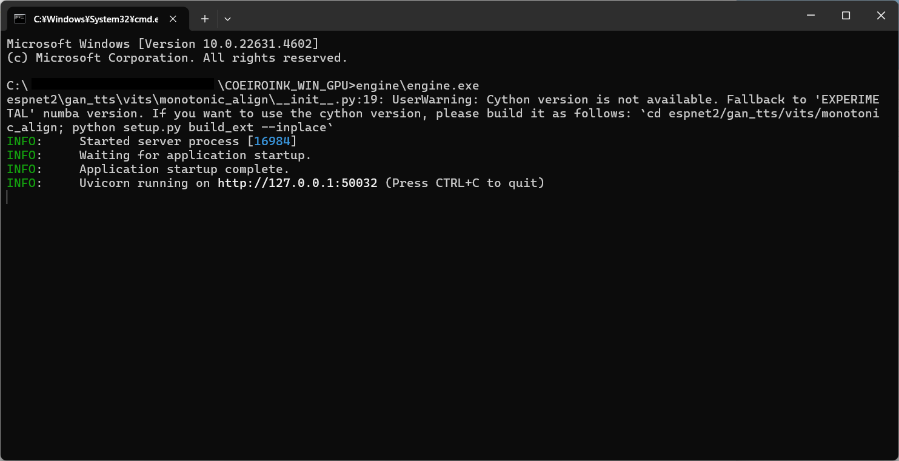

# 炬燵で快適！COEIROINKとZundaGPT2を別のPCで連携する方法

※この資料には技術的な専門用語がでてきます。

## 概要

この資料では COEIROINK を別のPCで動かしておいて、ZundaGPT2 をそこに接続して使う方法について記載します。

## 動機

[前の資料](炬燵で快適！VOICEVOXとZundaGPT2を別のPCで連携する方法.md)で VOICEVOX と ZundaGPT2 を別PCで連携させることに成功したので、それじゃ COEIROINK もってことでやってみました。

## 動作イメージ


## 作戦

やることは VOICEVOX と時と変わらないはずです。

別PCで COEIROINK のエンジンを起動し、Web API経由でテキストを音声データに変換できればOKです。

## COEIROINK エンジンの起動

COEIROINK は元々 VOICEVOX と関連するソフトだったはずだから、エンジンだけの起動もできるはず。

と、勝手に目算を立てて調べてみました。

できました。

VOICEVOXとは少し違うけど、コマンドプロンプトで COEIROINK をインストールしたフォルダに移動してから、以下のようにすればエンジンを起動できます。

```
engine\engine.exe
```



## 問題

VOICEVOX では `--host` オプションを使って、リスニングアドレスを指定できましたが、残念ながら COEIROINK ではそういった起動オプションが見つかりませんでした。

COEIROINK はソースが非公開だし、起動オプションに関するドキュメントもないようだし、ちょっと難しそうです。

知ってたら誰か教えて。

ローカルホストアドレスでリスニングしているようだし、このままでは外部PCから接続することはできません。

## 対策 - PortProxy

このままでは計画がダメになるので、`portproxy` を使って対策をすることにしました。

Windowsにはポートフォワーディングの機能があって、その機能を使えばうまくいきそうです。

COEIROINK は50032番ポートでリスニングしているようなので、ポート番号は変えずにアドレスだけ変換してやります。

デスクトップPCのIPアドレスが 192.168.1.100 の場合、以下のように設定します。

コマンドプロンプトを**管理者モード**で起動して実行してください。

```
netsh interface portproxy add v4tov4 listenaddress=192.168.1.100 listenport=50032 connectaddress=127.0.0.1 connectport=50032
```

これで 192.168.1.100:50032 に飛んできた通信は 127.0.0.1:50032 に転送されるようになります。

めでたしめでたし。

`netsh interface portproxy` は一度実行すると Windows に記憶されるため、何度も実行する必要はありません。

現在の設定状況を確認するには以下のコマンドを実行します。

```
netsh interface portproxy show all
```

設定を削除したい場合は次のようにします。

```
netsh interface portproxy delete v4tov4 listenaddress=192.168.1.100 listenport=50032
```

## ファイアウォールの設定

COEIROINK のリスニングポートは TCP 50032番ポート固定です。変更するオプションは見つかりませんでした。

通常 Windows はこのポートでの通信をファイアウォールでブロックしているので、TCP 50032番ポートの通信を許可する設定をする必要があります。

設定は `セキュリティが強化された Windows Defender ファイアウォール` で行ことができます。

`受信の規則`で`新しい規則`を作成し、TCP 50032番ポートの通信を許可します。

設定例は以下の通りです。

- **規制の種類**: ポート
- **プロトコルとポート**: TCP 50032番ポート
- **操作**: 接続を許可する
- **プロファイル**: プライベート（自分のネットワーク環境にあわせる必要があります）
- **名前**: COEIROINK API

## ZundaGPT2 の設定

ZundaGPT2 のインストールフォルダの直下に `appConfig.json` という設定ファイルがあるので、それを編集します。

`coeiroink_server`の値に、デスクトップPCのIPアドレスとポート番号を指定し、`coeiroink_path`の値を空文字にします。

編集例は以下のようになります。

```
    "tts": {
        "coeiroink_server": "http://192.168.1.100:50032",
        "coeiroink_path": "",
```

この編集を行って ZundaGPT2 を起動すると、デスクトップPCで動作している COEIROINK エンジンに接続し音声変換が行われるはずです。

## まとめ

COEIROINK を別のPCで動かして、それに ZundaGPT2 を接続するには以下の手順が必要です。

1. portproxyの設定
    - デスクトップPCのIPでリスニングして、それを 127.0.0.1に転送する

2. ファイアウォールの設定
    - TCP 50032番ポートを開放する

3. COEIROINK エンジンの起動
    - engine\engine.exe

4. ZundaGPT2 の設定
    - appConfig.json 中の coeiroink_server と coeiroink_path の値を変更

5. ZundaGPT2 の起動
    - キャラが喋ってくれれば成功
