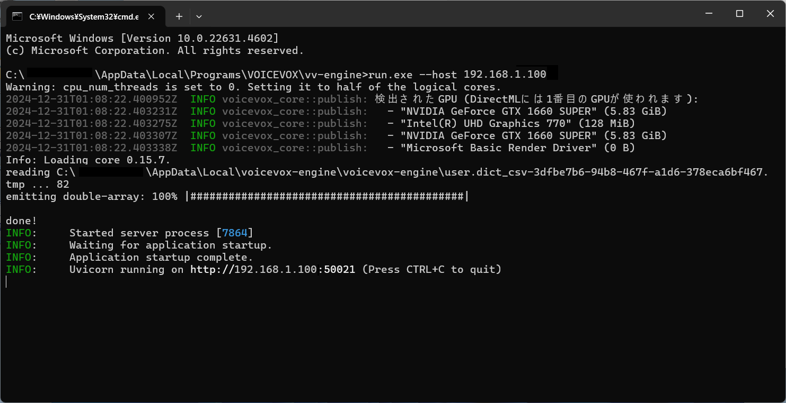

# 炬燵で快適！VOICEVOXとZundaGPT2を別のPCで連携する方法

※この資料には技術的な専門用語がでてきます。

## 概要

この資料では VOICEVOX を別のPCで動かしておいて、ZundaGPT2 をそこに接続して使う方法について記載します。

## 動機

VOICEVOX を動作させるにはそれなりのPCパワーを必要とします。

ZundaGPT2 を使用するPCが貧弱なノートPCだったりすると、VOICEVOX がサクサクと動かない可能性があります。

そのため、VOICEVOX はパワーのあるデスクトップPCで動かしておいて、貧弱なノートPCでは ZundaGPT2 だけを動作させようという作戦です。

素直にデスクトップPCを使えばいいじゃないかという意見もあるかと思いますが、要はデスクトップPCまで行くのは面倒くさいし寒いので、炬燵でぬくぬくしながらノートPCを使って ZundaGPT2 を動かしたいのです。

## 動作イメージ


## 作戦

VOICEVOX は音声変換機能を Web API で提供してくれています。

ZundaGPT2 もその Web API を呼び出してテキストを音声データに変換しています。

そのため、その Web API を外部のPCから呼び出せればうまくいくはずです。

## 実験

で、デスクトップPCで VOICEVOX を起動し、ノートPCからそいつに接続を試みました。

結果は失敗。

デスクトップPCの中からは Web API にアクセスできるのに、外部のノートPCからはアクセスできませんでした。

## 原因

原因は VOICEVOX がローカルホストアドレス（127.0.0.1）でリスニング（接続待機）しているせいでした。

ローカルホストアドレスでリスニングしているソケットには外部から接続できません。

## 対策

幸い VOICEVOX にホスト名を指定して起動するオプションがありました。

VOICEVOX はコマンドプロンプトから VOICEVOX エンジンのみを起動する（エディターは表示しない）際にそのオプションを指定することができます。

※ VOICEVOX はコア、エンジン、エディターの３層構造になっています。

## VOICEVOX エンジンの起動手順

VOICEVOX は通常次のフォルダにインストールされています。

```
C:\Users\[ユーザー名]\AppData\Local\Programs\VOICEVOX
```

VOICEVOX エンジンはその直下の`vv-engine`フォルダの中にあります。

VOICEVOX エンジンを起動するにはコマンドプロンプトでそのフォルダに移動し、`run.exe` を実行します。

リスニングアドレスを指定するには `--host` オプションを使用します。

例えば次のようにします。

```
cd %localappdata%\Programs\VOICEVOX\vv-engine
run.exe --host 192.168.1.100
```
※ `[ユーザー名]` は自分のユーザー名に置き換えてください。  
※ --host の後のIPアドレスは自分のデスクトップPCのアドレスを指定します。自PCのIPアドレスは `ipconfig` コマンドなどで調べることができます。

以上で、VOICEVOX エンジンが起動し接続待ち状態になるはずです。



## ファイアウォールの設定

VOICEVOX はデフォルトで TCP 50021番ポートでリスニングします（`--port`オプションでポート番号を変更することができます）。

通常 Windows はこのポートでの通信をファイアウォールでブロックしているので、TCP 50021番ポートの通信を許可する設定をする必要があります。

設定は `セキュリティが強化された Windows Defender ファイアウォール` で行ことができます。

`受信の規則`で`新しい規則`を作成し、TCP 50021番ポートの通信を許可します。

設定例は以下の通りです。

- **規制の種類**: ポート
- **プロトコルとポート**: TCP 50021番ポート
- **操作**: 接続を許可する
- **プロファイル**: プライベート（自分のネットワーク環境にあわせる必要があります）
- **名前**: VOICEVOX API

## ZundaGPT2 の設定

ZundaGPT2 のインストールフォルダの直下に `appConfig.json` という設定ファイルがあるので、それを編集します。

`voicevox_server`の値に、デスクトップPCのIPアドレスとポート番号を指定し、`voicevox_path`の値を空文字にします。

編集例は以下のようになります。

```
    "tts": {
        "voicevox_server": "http://192.168.1.100:50021",
        "voicevox_path": "",
```

この編集を行って ZundaGPT2 を起動すると、デスクトップPCで動作している VOICEVOX エンジンに接続し音声変換が行われるはずです。

## まとめ

VOICEVOX を別のPCで動かして、それに ZundaGPT2 を接続するには以下の手順が必要です。

1. ファイアウォールの設定
    - TCP 50021番ポートを開放する

2. VOICEVOX エンジンの起動
    - vv-engine\run.exe --host [IPアドレス]

3. ZundaGPT2 の設定
    - appConfig.json 中の voicevox_server と voicevox_path の値を変更

4. ZundaGPT2 の起動
    - キャラが喋ってくれれば成功
